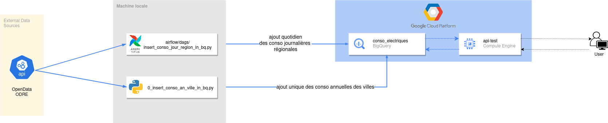
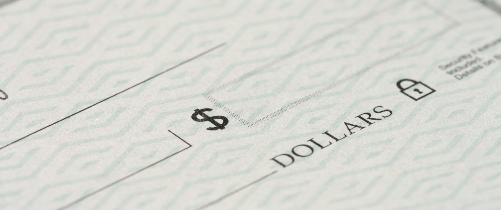

## Bonjour 👋

Data Scientist avec 4 années d'expériences dans ce domaine, je suis petit à petit monté en compétences sur les problématiques de Data Engineering au fil de mes missions professionnelles, en réalisant une formation dédiée chez [Blent.ai](https://blent.ai/formation/data-engineer), mais surtout motivé par une constante envie d'apprendre et de mettre oeuvre les meilleures pratiques 😁

## Mes principaux projets 🔨

### [API pour la consommation électrique des foyers](https://github.com/FrancLgd/PUBLIC-Projet-Data-Engineering-Tarification-Electrique)

- **Description** : Mise en place d'une architecture hébergée sur Google Cloud Plateform pour alimenter un applicatif d'évaluation de sa facture électrique

- **Technologies** : Python (numpy, pandas, pytest, requests), BigQuery, Flask, Airflow, Google Compute Engine

### [Agrégations sur les transactions enregistrées par une banque](https://github.com/FrancLgd/PUBLIC-Data-Engineering-Agregation-transactions-Spark)

- **Description** : Développement d'un job PySpark paramétré pour l'agrégation de données de transactions bancaires

- **Technologies** : HDFS, PySpark, Dataproc, Google Cloud SDK

### [Détection des anomalies de flux financiers avec Apache Kafka](https://github.com/FrancLgd/PUBLIC-Projet-Detection-anomalie-Kafka)

- **Description** : Mise en place d'un consumer Kafka pour l'analyse temps réel de transactions financières et la détection de fraudes

- **Technologies** : Python (scikit-learn, seaborn, pickle, venv), Kafka, Google Cloud Functions 

## Compétences

<!--
**FrancLgd/FrancLgd** is a ✨ _special_ ✨ repository because its `README.md` (this file) appears on your GitHub profile.

Here are some ideas to get you started:

- 🔭 I’m currently working on ...
- 🌱 I’m currently learning ...
- 👯 I’m looking to collaborate on ...
- 🤔 I’m looking for help with ...
- 💬 Ask me about ...
- 📫 How to reach me: ...
- 😄 Pronouns: ...
- ⚡ Fun fact: ...
-->
